# organyz

**Projeto:** organyz  
**Autor:** Nathan  
**GitHub:** [https://github.com/Ntzzn-Dev](https://github.com/Ntzzn-Dev)  
**Data:** 07/05/2025  
**Natureza:** Flutter (Dart), focado em Android  

  
  

## Descrição  

Um aplicativo para Android que te permite fazer anotações e marcações importantes.  
Indicado para uma melhor organização de links ou tarefas importantes.  

## Demonstração  

### Tela Principal  
Tela onde ficam todas os seus repositórios locais.  
Nela é possível exportar ou importar todo seu banco de dados (ou apenas um repositório) utilizando os botões no topo do app.  
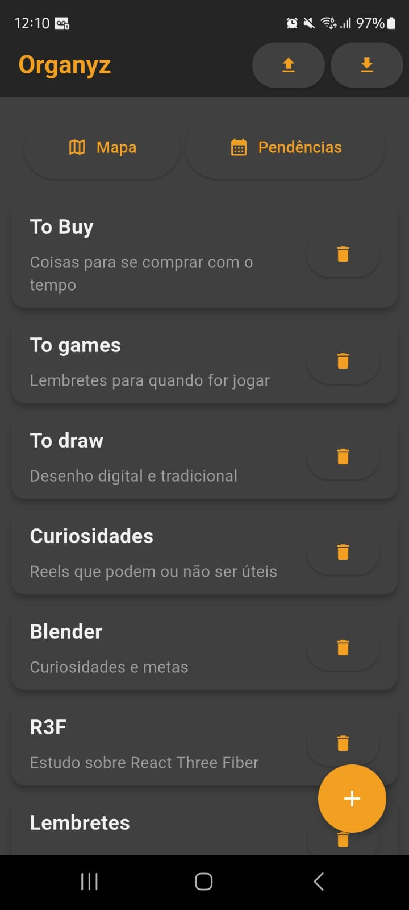  
Um exemplo de importação do banco préviamente exportado.  
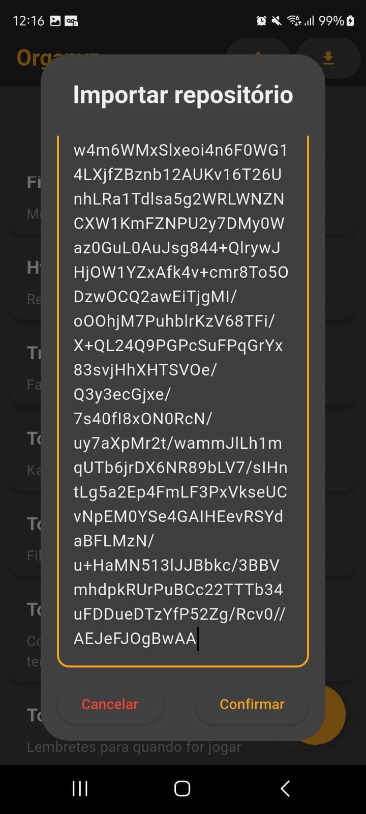  

### Widgets
Esse projeto conta com 5 diferentes tipos de widgets, todos contando com botão de edição e delete, sendo criados com telas semelhantes a essa:  
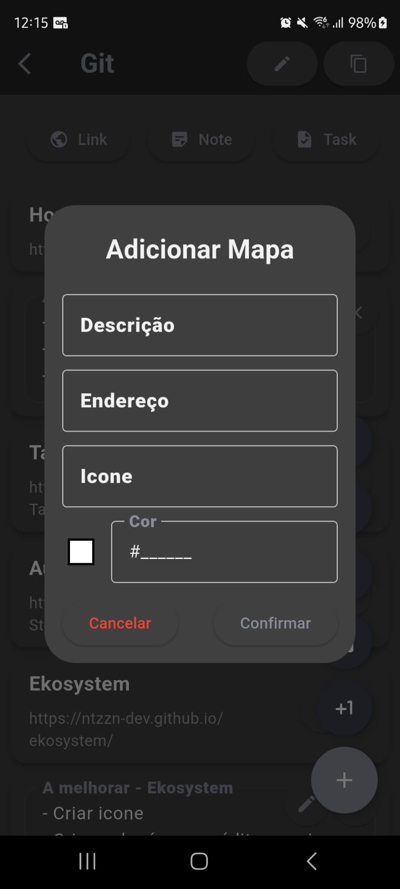  

#### Widget Link
É o widget mais simples, apenas guarda um link com um titulo para uma melhor organização.  
No lugar de ficar salvando links soltos em algum bloco de notas, aqui temos a possibilidade de copiar o link, ou acessa-lo com apenas um clique.  
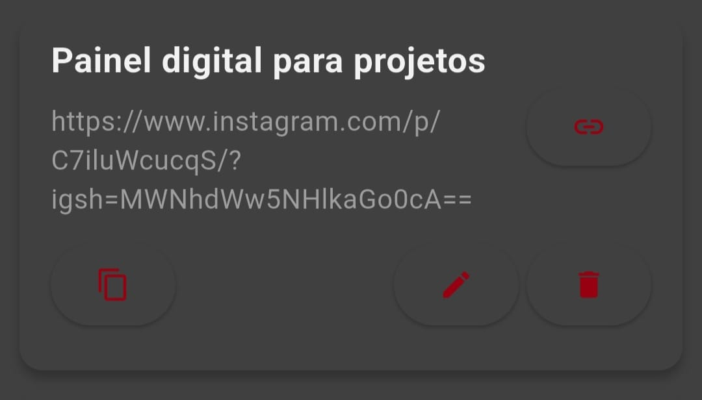  

#### Widget Note
Esse widget serve como um post it, apenas um pequeno bloco de notas para lembretes.  
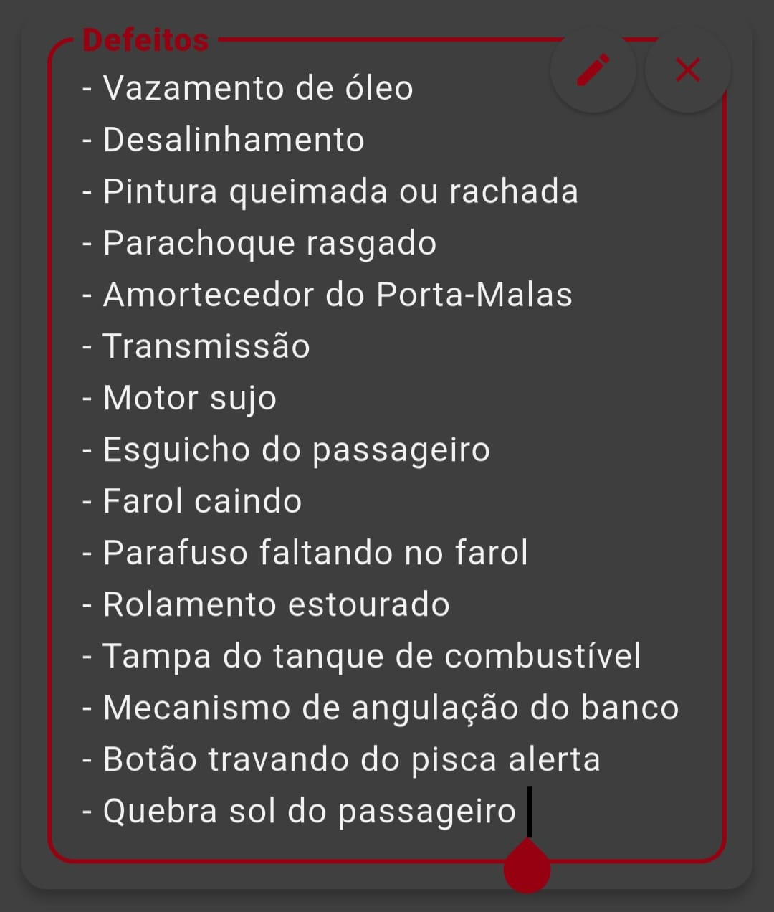  

#### Widget Cont
É um widget que a primeira vista é o menos útil, porém para tarefas simples e repetitivas, te ajuda a lembrar quantas vezes ja foram executadas.  
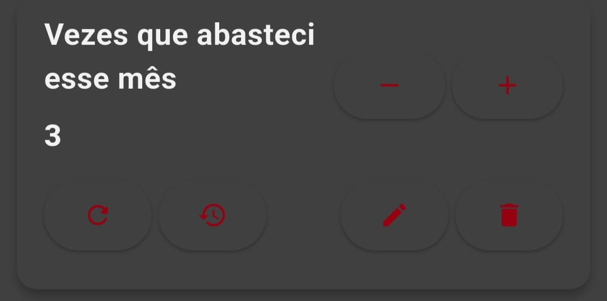  

Possui um botão de aumentar e diminuir como principais, mas quando o widget é expandido, outros dois novos botões são expostos.  
Um para reiniciar sua contagem, e um para mostrar seu histórico, onde podemos ver o intervalo de tempo entre um e outro.  
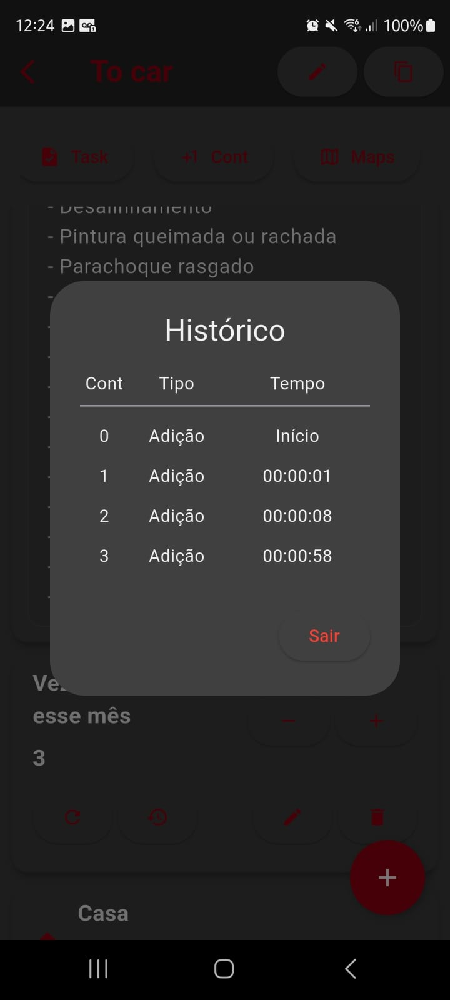   

#### Widget Task
É um bom Widget para se organizar com prazos, possui um sistema simples de três estados:  
- Iniciado  
- Em andamento  
- Concluido  

Quando possui um titulo igual a outra task, eles são separados em ordem de tempo.  
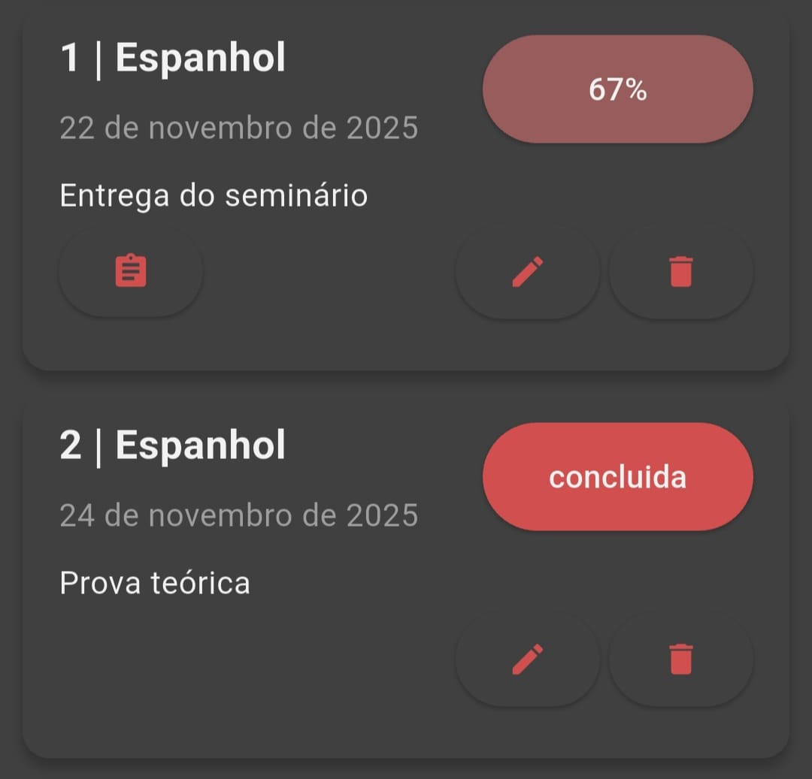  

Para uma melhor visualização, todas as tasks ficam expostas na aba pendências, na tela inicial.  
Funciona como um calendário, que apenas marca seus compromissos.  
Nessa tela, tem-se a possibilidade de limpar tarefas concluidas, tarefas que ja passaram do prazo, ou acessar a aba de quests para tasks.  
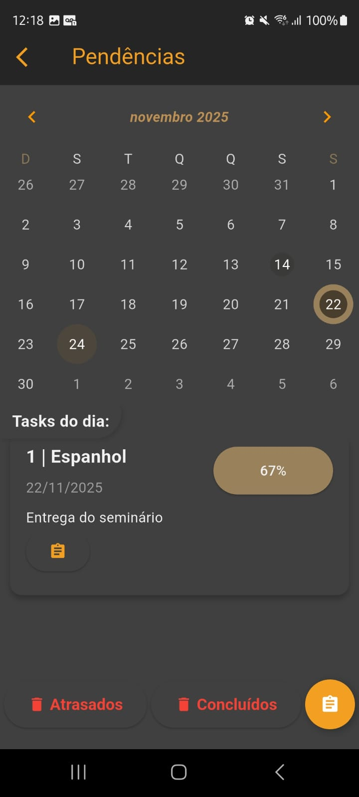  

Quando se quer fazer uma tarefa mais complexa, é possivel adicionar quests a essa task, tornando assim uma task de porcentagem, deixando os estados de lado.  
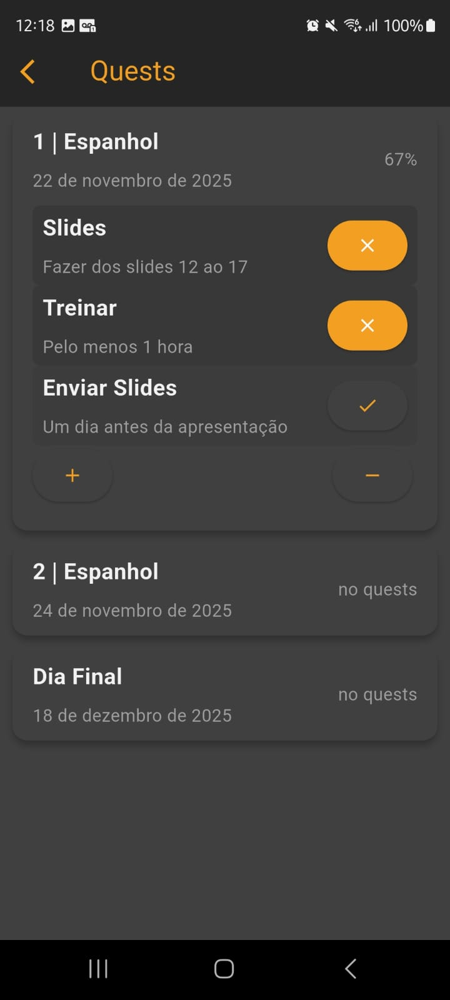  

#### Widget Maps
É o widget que te ajuda a ter uma boa noção espacial e geográfico de seus pontos de interesse.  
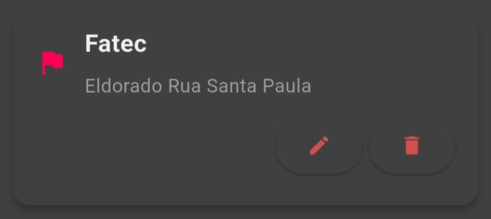  

Quanto mais pontos cadastrados melhor se torna sua leitura de espaço.  
Tornando possível calcular em Quilometros a distancia entre esses pontos.  
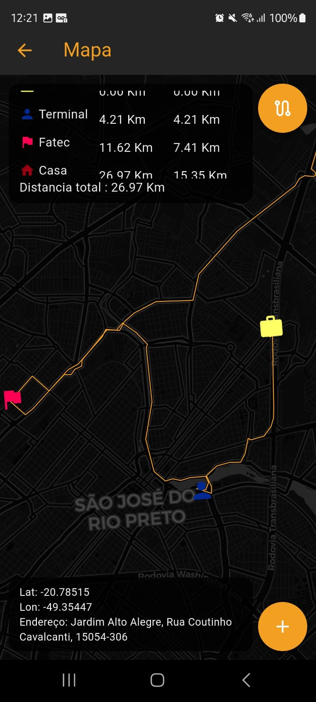  

Há também a possibilidade de criar um novo ponto diretamente do mapa, te retornando diretamente o endereço marcado, além de conseguimos mover um ponto ja existente, para um novo local clicado no mapa.  
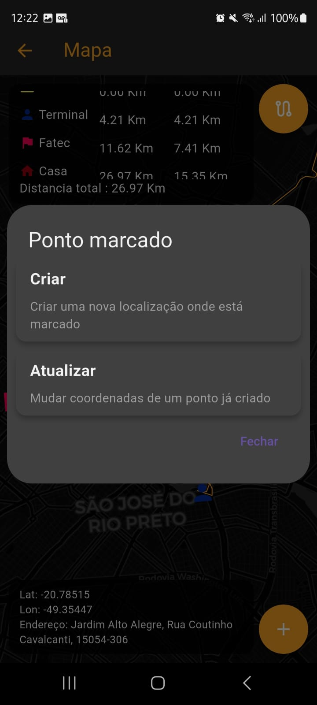  

## Tecnologias  
- Flutter (Dart)  
- SQLite (armazenamento local)  

## Contribuição
Sinta-se à vontade para abrir issues ou sugerir melhorias!  

## Log de versões
- **v4.0** → Adicionada forma de reposicionamento de repositórios e itens internos.
- **v5.0** → Suporte a multilines em títulos e descrições, novo botão de adição unificado, sistema de filtragem de itens e ajustes em caixas de texto.
- **v6.0** → Criação de contador e histórico de contagem, correções de filtros e itens vazios, otimizações no itemList e classe repository, popup de histórico, ajustes de mínimo/máximo e melhorias visuais.
- **v7.0** → Criação e gerenciamento de quests para tasks, reorganização otimizada de elementos, etapas e porcentagens em tasks, edição e exclusão de quests, popups melhorados, destaque visual de tasks expiradas, correções de título e visual de Pendências, ajustes de cores e tamanho de cards.
- **8.0** → Criação de um mapa com pontos de interesse pessoais, prático para verificar distancias entre lugares.

Veja o changelog completo em [CHANGELOG.md](CHANGELOG.md)